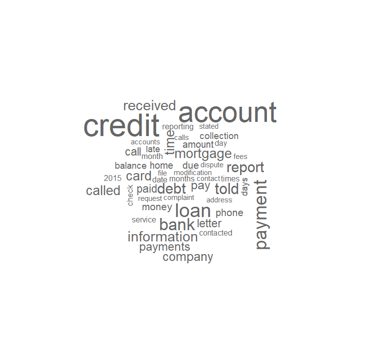
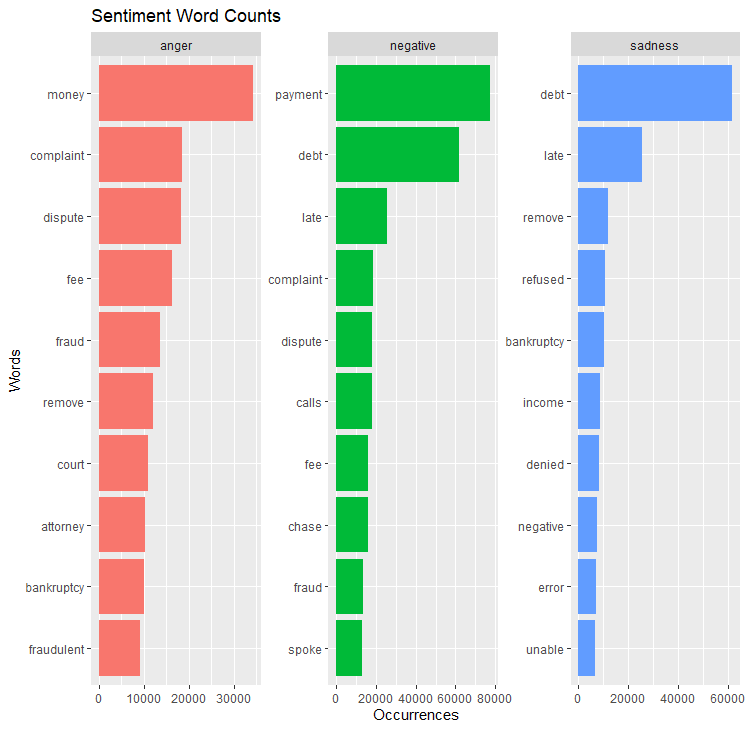
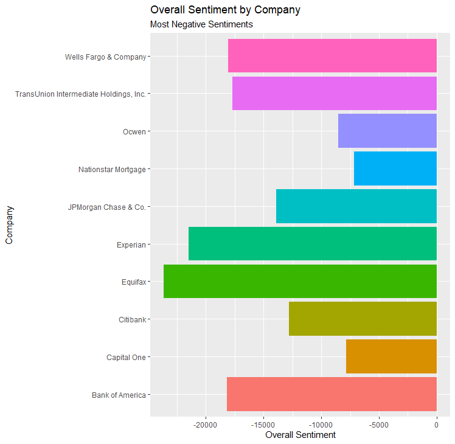
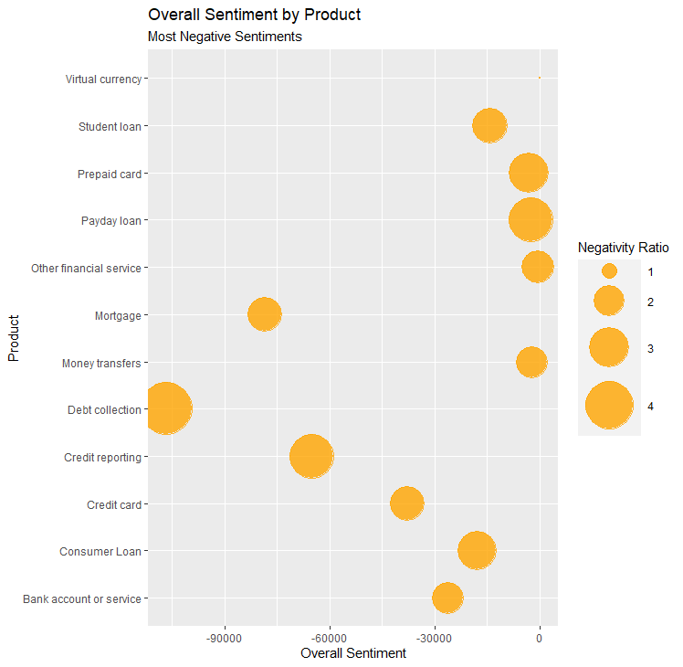
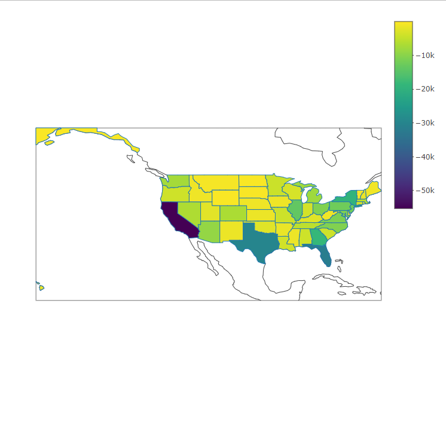
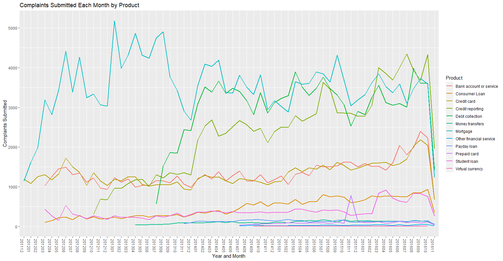

# **Complaint_Sentiment_Analysis**

## Introduction
- This document will provide a data dictionary, describe the data cleaning and preparation process, and provide analysis through visualizations.
---
## Data Dictionary :orange_book:
The columns that we used include:
- Product: The type of product that the consumer is submitting a complaint for
- Sub.product: A more detailed description of the product type
- Issue: The problem that prompted the customer to submit a complaint for the product
- Sub.issue: Further information/details regarding the issue
- Consumer.complaint.narrative: A detailed explanation provided by the customer regarding why they are filing a complaint
- Company: The company that sold the product
- State: The state from which the consumer submitted the complaint
- Date.sent: The date the customer sent the complaint to the company
- Company.response: A description of how the issue was closed/resolved
- Timely.response: Y/N field indicating whether the issue was resolved in a timely manner by the company
---

## Data Cleaning :broom:
1. Selected only the columns I deemed necessary or useful for analyis (removed 8)
```
my_data <- raw_data%>%
  dplyr::select("Product", "Sub.product", "Issue", "Sub.issue", "Consumer.complaint.narrative",
                "Company", "State",  "Date.sent.to.company", 
                "Company.response.to.consumer", "Timely.response.") %>%
```

2. Renamed columns for consistency and easier referencing
```
dplyr::rename("Timely.response" = "Timely.response.") %>%
dplyr::rename("Date.sent" = "Date.sent.to.company") %>%
dplyr::rename("Company.response" = "Company.response.to.consumer")
```

3. Removed entries with state values containing nonexistent state/US territory abbreviations
```
valid_data <- my_data %>%
  dplyr::filter(State != "AE",
                State != "MH",
                State != "AP",
                State != "FM",
                State != "MP",
                State != "PW",
                State != "AA")
```
---

## Data Preparation :hammer:
1. Separated words in cosumer complaints, arranged them in order from most to least common, and filtered out insignificant and mispelled words
```
complaint_analysis <- valid_data %>%
  unnest_tokens(word, Consumer.complaint.narrative) %>%
  count(word) %>%
  arrange(desc(n)) %>%
  anti_join(stop_words) %>%
  dplyr::filter(word != "xxxx",
                word != "xx",
                word != "n't",)
```

2. Set up a new data frame with the first step of the previous preparation process to be used for sentiment analysis
```
narrative_text <- valid_data %>% 
  unnest_tokens(word, Consumer.complaint.narrative) %>% 
  anti_join(stop_words)
```

3. Appended the nrc lexicon and filtered for undesirable emotions/sentiments present in consumer narratives
```
sentiment_consumer <- narrative_text %>%
  inner_join(get_sentiments("nrc")) %>% 
  filter(sentiment %in% c("negative", "sadness", "anger")) %>%
```

4. Appended the bing lexicon in three separate data frames to calculate sentiment values related to companies, products, and states
```
company_sentiment <- narrative_text %>%
  inner_join(get_sentiments("bing"))
  
product_sentiment <- narrative_text %>%
  inner_join(get_sentiments("bing"))
  
state_sentiment <- narrative_text %>%
  inner_join(get_sentiments("bing"))
```

5. Converted Date.sent column to date format from character, separated and concatenated month and year values, grouped num_complaints by designated columns, and displayed distinct values by relevant rows
```
date_sent <- setDT(valid_data) %>%  
  .[,Date.sent := as.Date(Date.sent, format = "%m/%d/%Y")] %>%
  .[,Year.sent := year(Date.sent)] %>%
  .[,Month.sent := month(Date.sent)] %>%
  .[,Year.month := ifelse(nchar(Month.sent) == 2, paste0(Year.sent, Month.sent), paste0(Year.sent, "0",Month.sent))] %>%
  .[,num_complaints := .N, keyby = .(Year.sent, Month.sent, Product)]
 
  date_sent <- unique(date_sent[,.(Year.sent, Month.sent, Product, Year.month, num_complaints)]) 
```
---

# Data Analysis :mag:
1. Which words appeared most often in the consumer narratives?
- Used complaint analysis df (no lexicon applied) for this in order to get a true idea of the most common words--words that were not present in the lexicon would not be displayed in the visualization if sentiment analysis was utilized
```
wordcloud(
  words = complaint_analysis$word,
  freq = complaint_analysis$n,
  max.words = 50,
  colors = "grey40"
)
```
 

- Account, credit, payment, bank, and loan are the 5 most common words.
- 2015 is the only year present within the wordcloud despite 5 years worth of data being included in the dataset (December 2011 - November 2016)--leads me to infer 2015 was the year with the most complaints submitted.
- The majority of words displayed are not overtly or inherently negative.

2. Which words related to the sentiments of "negative", "anger", and "sadness" appear most often?
- To conduct this analysis, I counted by word and sentiment, took the top 10 for each sentiment, and created a column that has each word ordered by the count.
```
sentiment_consumer <- narrative_text %>%
  count(word, sentiment) %>% 
  group_by(sentiment) %>% 
  top_n(10, n) %>% 
  ungroup() %>% 
  mutate(word2 = fct_reorder(word, n))
```
Using ggplot, the following visualization was produced:

 <br>
- This graph shows that "negative" sentiments are the most common, among the three displayed, in the consumers' complaint submissions. It is the most prevalent by a large margin since the two most common words communicating sadness are also treated as negative by the nrc lexicon.
- This visualization indicates that undesirable sentiments such as the three shown above are quite common within the complaints given that only approximately 114,000 consumer.complaint.narratives were submitted out of the 670,598 unique complaint submissions within the dataset. 

3. Which companies had the most negative sentiments associated with themselves overall?
- To prepare the data for visualization, I took counts of company and sentiment, spread the sentiment and count columns, computed the difference between positive and negative sentiment, and ordered the top 10 companies from most to least negative.
```
company_sentiment <- narrative_text %>%
  count(Company, sentiment) %>% 
  spread(sentiment, n) %>% 
  mutate(overall_sentiment = positive - negative) %>%
  arrange(overall_sentiment) %>%
  head(n=10)
```
Using ggplot, I organized this information in the bar plot shown below:

 <br>
- Equifax, a company that specializes in consumer credit reporting, has the largest disparity between negative and positive sentiments from customers. 
- These ten companies are broken into three primary groups or services regarding what they provide, those being: financial services/banking, mortgage loans, and consumer credit reporting. 
- Among these classifications, consumer credit reporting companies have the lowest average overall sentiment, banking/financial services companies are in the middle, and mortgage loan companies have the highest average overall sentiment within the context of this visualization.

4. Which products had the lowest sentiment scores?
- The steps taken to enable visualization for this chart were the same as for the previous plot aside from switching out the counts of companies for products. 
```
product_sentiment <- narrative_text %>%
  count(Product, sentiment) %>% 
  spread(sentiment, n) %>% 
  mutate(overall_sentiment = positive - negative) %>%
  arrange(overall_sentiment) 
```
I then used ggplot to produce a bubble chart for the data:

 <br>
- Virtual currency is the only product with a positive overall sentiment (with a value of 10), but those results can be dismissed due to the fact that the sample size for this specific product was so small; it consisted of only 58 instances of positive or negative sentiments overall.
- Debt collection has both the highest negativity ratio and lowest overall sentiment among these products. 
- Despite approximately the same amount of negative sentiments being associated with mortgages as there were with debt collection, the overall sentiment of mortgages was substantially lower due to its significantly lower negativity ratio ratio relative to debt collection. 
- This graph reveals that none of the products (apart from virtual currency) have more positive words associated with them than negative within consumer comments, which is to be expected since the dataset pertains to complaints from customers.

5. How do the sentiment scores of US states compare to one another?
- As with the previous two visualizations,  I took counts of state and sentiment, spread the sentiment and count columns, computed the difference between positive and negative sentiment, and sorted the states from lowest to highest sentiment scores.
```
state_sentiment <- narrative_text %>%
  count(State, sentiment) %>% 
  spread(sentiment, n) %>%  
  mutate(overall_sentiment = positive - negative) %>%
  arrange(overall_sentiment) 
```
Using plotly, I created a map (that is slightly more interactive in r) for the data:

 <br>
- The sentiment scores tie in closely with the relative populations of the states--the more people that live there, the lower the overall sentiment.
- For this reason, the western Midwest states and Mountain states all have relatively high overall sentiment values due to being sparsely populated.
- California, Florida, Texas, New York, and Georgia are the five states with the lowest sentiment scores.

6. How did the number of complaints submitted by product change over time?
- I chose to display this information within a shiny app. Important code for setting up the data selection interface and collecting inputs from users is included below:
```
fluidRow(
    column(2,
           selectizeInput('Product_choice', 'Choose Product', date_sent$Product, multiple = TRUE, selected = "Credit     card"),
           selectInput('Start_date', 'Choose Start Date', date_sent$Year.month),
           selectInput('End_date', 'Choose End Date', date_sent$Year.month),
           #used to display results for desired inputs
           actionButton("Button", "Go")
 
  observeEvent(input$Button, {  
  date_sent <- date_sent[Product %in% input$Product_choice]
  date_sent <- date_sent[between(as.numeric(Year.month), input$Start_date, input$End_date)]
```
This was the basis of the code which was used to produce the following visualization (when all products and month values are included):

 <br>
- This dynamic visualization is great for analyzing consumer complaint trends over time by product; however, it is not very good for identifying specific values one might be interested in due to the small date values on the x-axis
- Mortgages were the product that the most complaints were submitted for. Credit reporting and debt collection products came close or even surpassed mortgages during several months, but mortgages consistently prompted the most issues or consumer submissions within this five year period.
- The number of total complaints submitted remained quite consistent over the timeline of this dataset apart from late 2013 - early 2014 when either substantially more credit reporting and debt collection complaints were submitted or more data was collected regarding complaints of these types.
